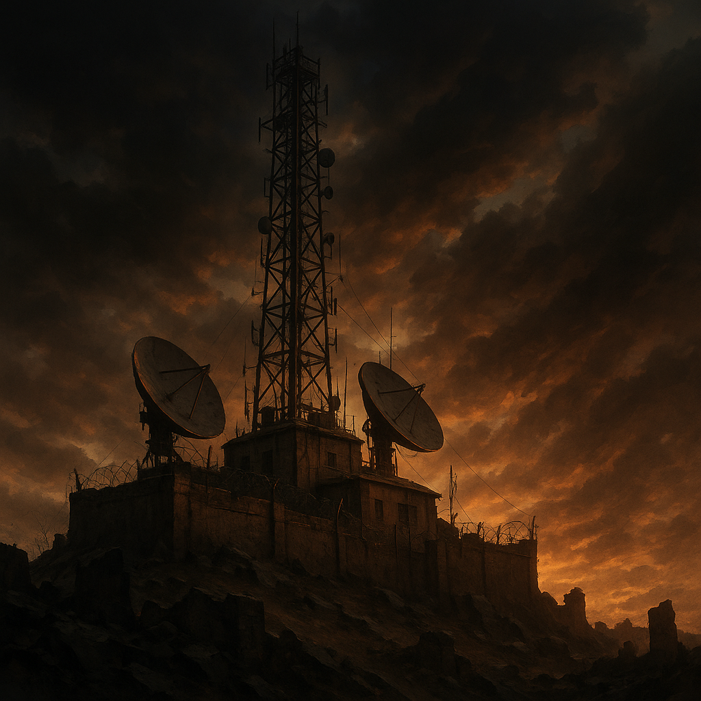

# Radiostation

Die Radiostation bündelt die beiden wichtigsten Stimmen im Äther der [Wasteland](../Kanon/glossar.md#wasteland): das menschliche, chaotische **[Doomsday Radio](../Kanon/glossar.md#doomsday-radio)** und das kalte, systemische **[STACKCAST](../Kanon/glossar.md#stackcast)**. Der eine Kanal hält Erinnerungen, Gerüchte, Warnungen und Kultur am Leben. Der andere setzt Schwellenwerte, Drohlogik und Verhaltenssteuerung durch.

## Funkräume

- **Doomsday Radio:** letzter großer Menschensender, getragen von improvisierter Technik, den zentralen Profilen unter [../Charaktere/index.md](../Charaktere/index.md), Bots und einem Hörerraum, der im Chaos trotzdem wiedererkennbare Rituale sucht.
- **STACKCAST:** Eingriffs- und Warnkanal des [Stack](../Kanon/glossar.md#der-stack), präzise, emotionslos und oft bedrohlicher durch seine Klarheit als durch Lautstärke.

## Einstieg

- **Sender, Standort und Empfang:** [../Orte/Sonstiges/Doomsday-Radiosender.md](../Orte/Sonstiges/Doomsday-Radiosender.md)
- **Dispatcher und menschliche Stimmen:** [../Charaktere/index.md](../Charaktere/index.md) und [../Gruppen/Maker/doomsday-dispatcher.md](../Gruppen/Maker/doomsday-dispatcher.md)
- **Programm und wiederkehrende Slots:** [programm.md](programm.md)
- **Tagesdestillat als Podcast (Doomsday Dispatch):** [podcast.md](podcast.md)
- **Redaktionsworkflow:** [redaktionsworkflow.md](redaktionsworkflow.md)
- **Geschichten im Radio:** [Die-Jagd-um-Laura/index.md](Die-Jagd-um-Laura/index.md)
- **Radio-Bots und modulare Segmente:** [Bots/index.md](Bots/index.md)
- **Musik, Bands und Kataloglogik:** [Bands/index.md](Bands/index.md) und [../Orte/Sonstiges/Stranded-Stranglers.md](../Orte/Sonstiges/Stranded-Stranglers.md)
- **StackCast im Detail:** [../Gruppen/DerStack/StackCast.md](../Gruppen/DerStack/StackCast.md)

## Story-Hinweis

[Doomsday Radio](../Kanon/glossar.md#doomsday-radio) ist das laute Restherz der Menschheit. [STACKCAST](../Kanon/glossar.md#stackcast) ist die Stimme der Systemordnung. Solange beide senden, ist die Welt nicht entschieden, sondern auf Sendung.
